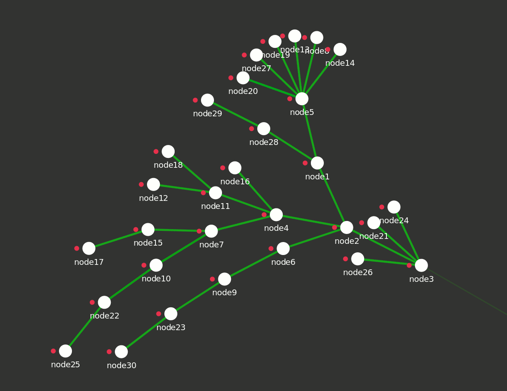

# pynet

The *pynet* tools helps in creating virtual mesh topologies
with gluon firmwares using the qemu virtualization
technology. It provides a simple language, where you can
build your topology file in. You can create nodes by
simply calling a function `Node()` and connect them by
calling the `connect()` function. Then pynet does the rest:

1. It starts a qemu instance for each node by using the `image.img` firmware image from the root of the project directory.
2. It connects nodes together as expected using qemus network capabilities.
3. It configures the node though the *config mode* of gluon using an ssh session.
4. For each node, it also simulates a client device by using the linux network namespaces technology.
5. To manage all the shell accesses to the different nodes and clients, pynet uses a tmux session and gives therefore access to all nodes and simulated clients.

Sadly, the tool needs root access on your device, since
managing linux network namespaces and network interfaces
is nearly impossible without root access.



## Requirements

- Linux OS
- At least python3.6
- qemu
- tmux
- python lib asyncssh

``` shell
pacman -S qemu tmux python python-pip
pip install -r requirements.txt
```

## Quickstart

``` shell
sh update_image.sh                        # download an image
sudo python36 scenarios/chain_4_nodes.py  # start a scenario
```

## Example scenario

Here we connect three nodes in a chain. The syntax is
standard python syntax.
```
#!/usr/bin/python36
import sys
sys.path.append(".")
from pynet import *

a = Node()
b = Node()
c = Node()

connect(a, b)
connect(b, c)

run_all()
```

## Advanced gimmics

- Both nodes and simulated clients support resolving names of each other. ```ping client5```
- Nodes also support this command for bat-hosts. ```batctl tr node2```
- To manage ssh connections, pynet automatically generates an rsa key, which is added into the image during config mode.
- Spawing firefox as a client of a router is also possible. This is very helpful to see the statuspage of a router. Please note, that the shells opened by pynet are root shells. So if you directly start firefox inside such a shell, it has root access.


### set fastd secret

``` python
node.set_fastd_secret('e88b6e7adf88ffb9448293ab008f2fde9a06d012973b7a73cb4947781f6020f2')
```
